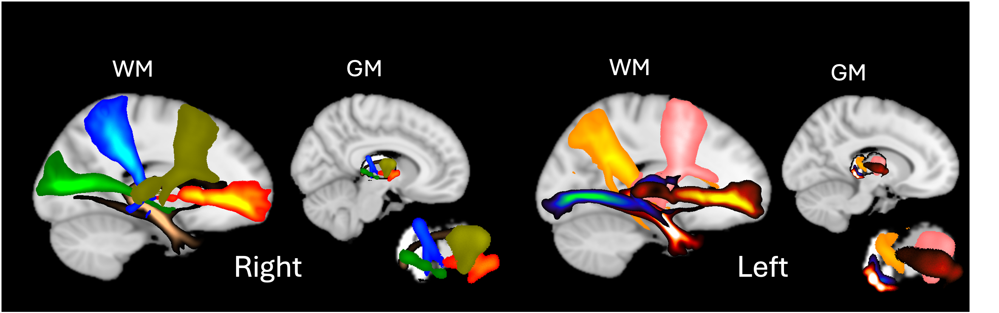

NFACT documentation
======================================

**NFACT** (Non-negative matrix Factorisation of Tractography data) is a set of modules (as well as an end to end pipeline) that decomposes 
tractography data using NMF/ICA.

It consists of three "main" decomposition modules:
  - nfact_pp (Pre-process data for decomposition)
  - nfact_decomp (Decomposes a single or average group matrix using NMF or ICA)
  - nfact_dr (Dual regression on group matrix)

And three auxiliary modules:
  - nfact_config (Creates config files for the pipeline and changing any hyperparameters)
  - nfact_Qc (Creates hitmaps to check for bias in decomposition)
  - nfact_stats (Creates Spatial maps and component loadings for further statistical testing)

and a pipeline wrapper
    - nfact (runs nfact_pp, nfact_decomp, nfact_Qc and nfact_dr. nfact_pp, nfact_Qc and nfact_dr can all individually be skipped)