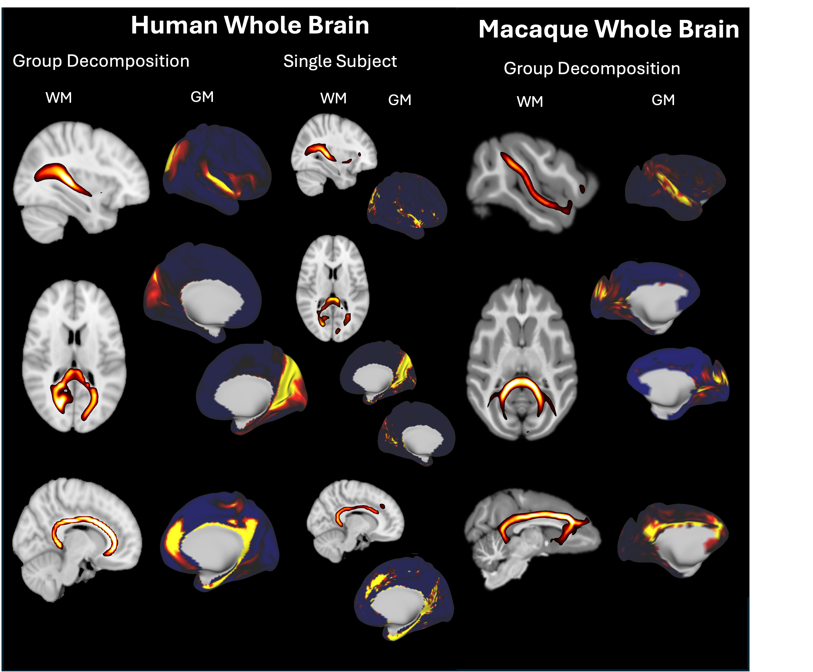

Examples
============
Here is some examples of how to use NFACT. 

HCP style HUMAN data 
--------------------
These examples assumes that you have ran pre-freesurfer, freesurfer, post-freesurfer & the diffusion parts of the HCP pipeline

NMF with 200 dimensions and mutlicore processing
^^^^^^^^^^^^^^^^^^^^^^^^^^^^^^^^^^^^^^^^^^^^^^^^

Config File

.. code-block:: json

  {
      "global_input": {
       "list_of_subjects": "/path_to/nfact_config.sublist",
       "outdir": "/out_dir/path",
       "seed": [
           "Required unless file_tree specified"
       ],
       "overwrite": true,
       "pp_skip": false,
       "dr_skip": false,
       "qc_skip": false,
       "folder_name": "nfact_HCP"
      },
      "cluster": {
          "cluster": false,
          "cluster_queue": "None",
          "cluster_ram": "60",
          "cluster_time": false,
          "cluster_qos": false
      },
      "nfact_pp": {
          "gpu": true,
          "file_tree": "hcp",
          "warps": [],
          "bpx_path": false,
          "roi": [],
          "seedref": false,
          "target2": false,
          "nsamples": "1000",
          "mm_res": "3",
          "ptx_options": false,
          "exclusion": false,
          "stop": false,
          "absolute": false,
          "dont_save_fdt_img": false,
          "n_cores": 5
      },
      "nfact_decomp": {
          "dim": "200",
          "algo": "NMF",
          "roi": true,
          "config": false,
          "iterations": "20",
          "n_cores": "1",
          "no_sso": false,
          "cifti": false,
          "disk": false,
          "wta": false,
          "wta_zthr": "0.0",
          "normalise": false,
          "threshold": "3",
          "components": "1000",
          "pca_type": "pca",
          "sign_flip": true
      },
      "nfact_dr": {
          "normalise": false,
          "cifti": false,
          "threshold": "3",
          "n_cores": 10
      },
      "nfact_qc": {
          "threshold": "2"
      }
  }

Run with::
    
    nfact -c nfact_config.pipeline

Downsampling ICA Cluster 
^^^^^^^^^^^^^^^^^^^^^^^^^^
This assumes that there is a downsampling folder with volumes and surfaces (located at the same level as the T1w & MNINonLinear), it is going to be run on a cluster with ICA 200 dimensions, and mutlicore processing for the dual regression and :

Config file

.. code-block:: json

  {
      "global_input": {
          "list_of_subjects": "/path_to/nfact_config.sublist",
          "outdir": "/out_dir/path",
          "seed": [
              "Required unless file_tree specified"
          ],
          "overwrite": true,
          "pp_skip": false,
          "dr_skip": false,
          "qc_skip": false,
          "folder_name": "nfact_HCP_cifti"
      },
      "cluster": {
          "cluster": true,
          "cluster_queue": "my_partition",
          "cluster_ram": "60",
          "cluster_time": false,
          "cluster_qos": false
      },
      "nfact_pp": {
          "gpu": true,
          "file_tree": "hcp_cifti",
          "warps": [],
          "bpx_path": false,
          "roi": [],
          "seedref": false,
          "target2": false,
          "nsamples": "1000",
          "mm_res": "3",
          "ptx_options": false,
          "exclusion": false,
          "stop": false,
          "absolute": false,
          "dont_save_fdt_img": false,
          "n_cores": false
      },
      "nfact_decomp": {
          "dim": "200",
          "algo": "ICA",
          "roi": true,
          "config": false,
          "iterations": "20",
          "n_cores": "1",
          "no_sso": false,
          "cifti": true,
          "disk": false,
          "wta": false,
          "wta_zthr": "0.0",
          "normalise": true,
          "threshold": "3",
          "components": "1000",
          "pca_type": "pca",
          "sign_flip": true
      },
      "nfact_dr": {
          "normalise": true,
          "cifti": true,
          "threshold": "3",
          "n_cores": 10
      },
      "nfact_qc": {
          "threshold": "2"
      }
  }

Run with::
    
    nfact -c nfact_config.pipeline

Non HCP style data
--------------------

Non-Human data no filetree
^^^^^^^^^^^^^^^^^^^^^^^^^^^

This is for animal data where seed references need to be changed and warps are .mat files. A ptx options file is given to reduce the step length. Due to animal data being lower quality the resoltuion is going to be set to 1mm for the downsampling. THe decomposition is NMF with everything being run locally. The threshold for the nfact_Qc is going to be lowered and there will be no thresholding of components before saving.

Config file 

.. code-block:: json

  {
      "global_input": {
          "list_of_subjects": "/path_tos/nfact_config.sublist",
          "outdir": "/path_to/",
          "seed": [
              "preconall/lh.white.surf.gii",
              "preconall/rh.white.surf.gii"
          ],
          "overwrite": true,
          "pp_skip": true,
          "dr_skip": true,
          "qc_skip": true,
          "folder_name": "nfact"
      },
      "cluster": {
          "cluster": false,
          "cluster_queue": "None",
          "cluster_ram": "60",
          "cluster_time": false,
          "cluster_qos": false
      },
      "nfact_pp": {
          "gpu": true,
          "file_tree": false,
          "warps": ["transform/acpc2preconall.mat", "transform/preconall2acpc.mat"],
          "bpx_path": "acpc",
          "roi": ["preconall/lh.medialwallneg.func.gii",
              "preconall/rh.medialwallneg.func.gii"],
          "seedref": "/path_to/sub1/preconall/T2_dingo.nii.gz",
          "target2": false,
          "nsamples": "1000",
          "mm_res": "1",
          "ptx_options": "/path_to/ptxopts.txt",
          "exclusion": false,
          "stop": false,
          "absolute": false,
          "dont_save_fdt_img": false,
          "n_cores": false
      },
      "nfact_decomp": {
          "dim": "50",
          "algo": "NMF",
          "roi": true,
          "config": false,
          "iterations": "20",
          "n_cores": "1",
          "no_sso": false,
          "cifti": true,
          "disk": false,
          "wta": false,
          "wta_zthr": "0.0",
          "normalise": true,
          "threshold": "0",
          "components": "1000",
          "pca_type": "pca",
          "sign_flip": true
      },
      "nfact_dr": {
          "normalise": false,
          "cifti": false,
          "threshold": "0",
          "n_cores": false
      },
      "nfact_qc": {
          "threshold": "1"
      }
  }

Run with::
    
    nfact -c nfact_config.pipeline

Non-Human with filetree
^^^^^^^^^^^^^^^^^^^^^^^^

THe same data but this time with a custom filetree sepcifying where the data is and a customised target image

Config file 

.. code-block:: json

  {
      "global_input": {
          "list_of_subjects": "/path_tos/nfact_config.sublist",
          "outdir": "/path_to/",
          "seed": [
              "preconall/lh.white.surf.gii",
              "preconall/rh.white.surf.gii"
          ],
          "overwrite": true,
          "pp_skip": true,
          "dr_skip": true,
          "qc_skip": true,
          "folder_name": "nfact"
      },
      "cluster": {
          "cluster": false,
          "cluster_queue": "None",
          "cluster_ram": "60",
          "cluster_time": false,
          "cluster_qos": false
      },
      "nfact_pp": {
          "gpu": true,
          "file_tree": "/path/to/filetree.filtree",
          "warps": [],
          "bpx_path": false,
          "roi": [],
          "seedref": "/path_to/sub1/preconall/T2_dingo.nii.gz",
          "target2": "/path_to/sub1/preconall/target_2.nii.gz",
          "nsamples": "1000",
          "mm_res": "1",
          "ptx_options": "/path_to/ptxopts.txt",
          "exclusion": false,
          "stop": false,
          "absolute": false,
          "dont_save_fdt_img": false,
          "n_cores": false
      },
      "nfact_decomp": {
          "dim": "50",
          "algo": "NMF",
          "roi": true,
          "config": false,
          "iterations": "20",
          "n_cores": "1",
          "no_sso": false,
          "cifti": true,
          "disk": false,
          "wta": false,
          "wta_zthr": "0.0",
          "normalise": true,
          "threshold": "0",
          "components": "1000",
          "pca_type": "pca",
          "sign_flip": true
      },
      "nfact_dr": {
          "normalise": false,
          "cifti": false,
          "threshold": "0",
          "n_cores": false
      },
      "nfact_qc": {
          "threshold": "1"
      }
  }

Run with::

  nfact -c nfact_config.pipeline
