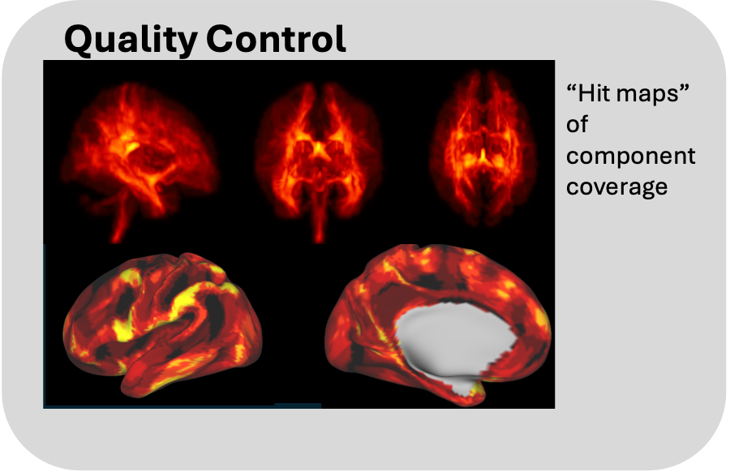

NFACT Quality Control
=====================
This is a quality control module that creates a number of hitmaps that can be used to check for bias in decomposition.

.. toctree::
   :maxdepth: 5
   :caption: NFACT Quality Control

   nfact_Qc_details