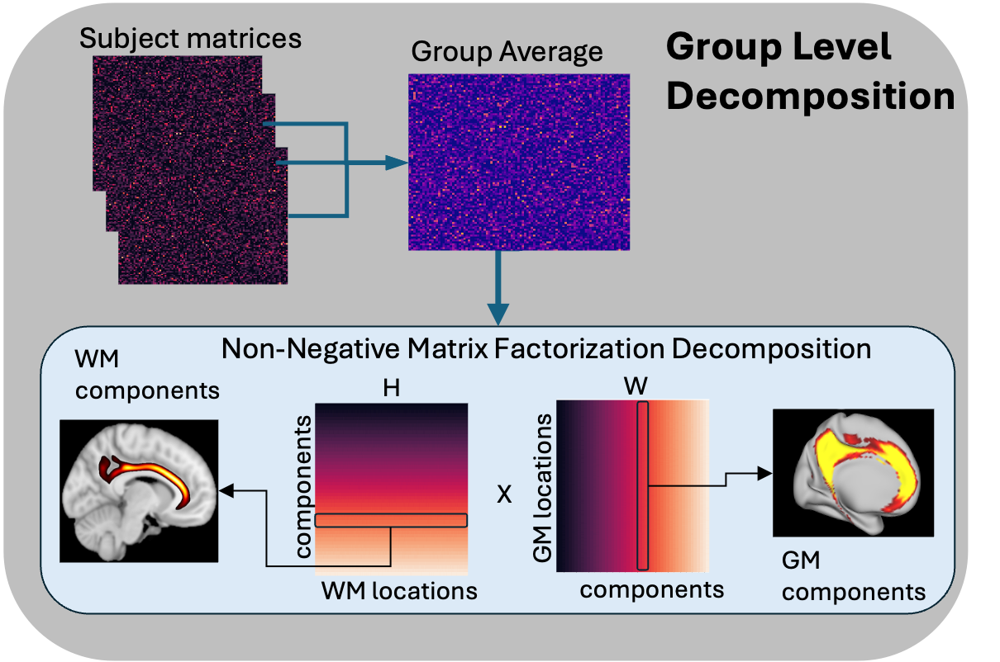

NFACT Decomposition
===================
This is the main decompoisition module of NFACT. 

It runs decomposition at either the single subject or group level and saves the resultant white and grey matter connectivity patterns as imaging files (.nii.gz/.func.gii/.dscalar.nii) depending on input.

Though NFACT has NMF in its name it does offer support for ICA.

.. toctree::
   :maxdepth: 5
   :caption: NFACT Decomposition

   nfact_decomp_details