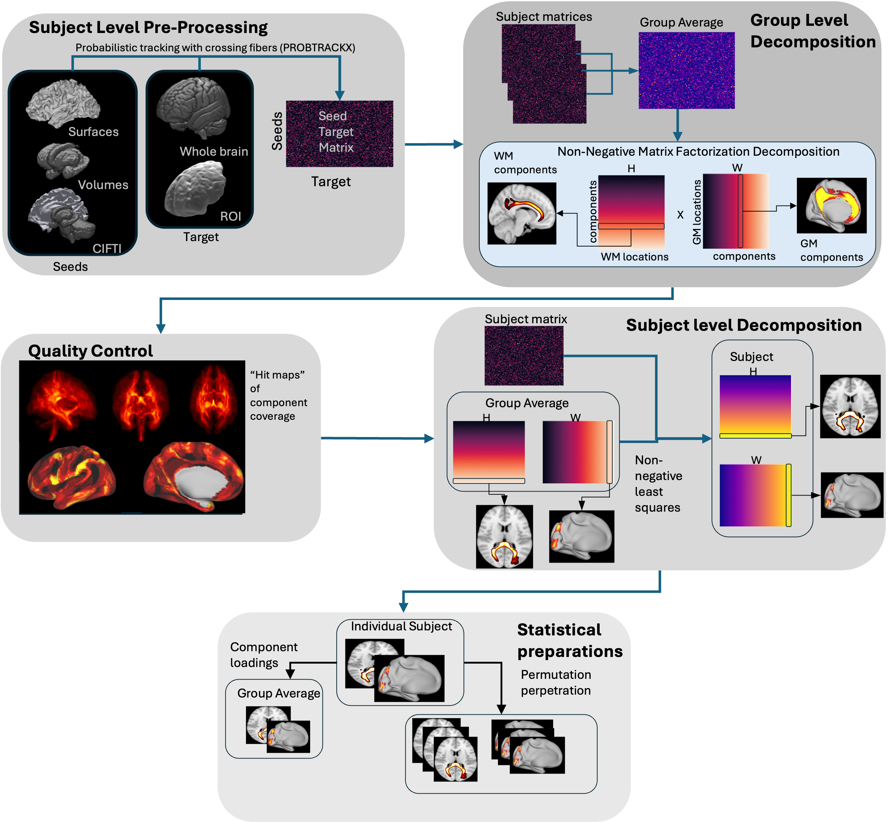

NFACT Pipeline
===============
This module runs the pipleine end to end. It is fully customisable via a config file but can also be ran with minimal inputs

.. toctree::
   :maxdepth: 5
   :caption: NFACT Pipleine

   nfact_pipeline_details